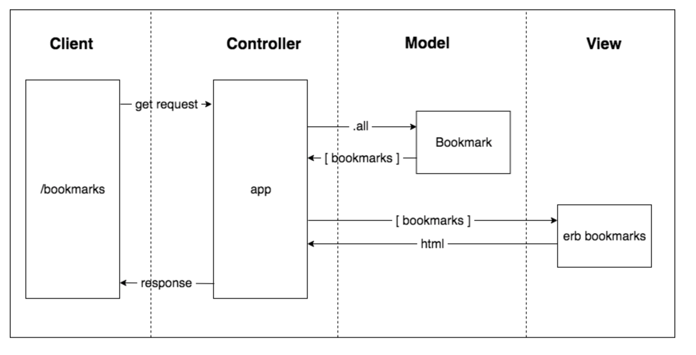

### User story 1

```
As a user,
So that I can refer to and use my bookmarks
I would like my bookmark manager to store my bookmarks and present them in a list.

```

### User story 1 model




### Instructions to use postgresql

#### How to install postgresql (using homebrew)

  1. Open your terminal and run the command 'brew install postgresql'
  2. To verify you have installed it correctly, run the following command 'brew services start postgresql'

#### How to set up and use postgresq; database

  1. Connect to psql by typing 'psql' in the terminal
  2. Create the database using the psql command CREATE DATABASE "bookmark_manager";
  3. Connect to the database using the pqsl command \c "bookmark_manager";
  4. Run the query we have saved in the file 01_create_bookmarks_table.sql

#### How to set up and use postgresq; test database

  1. Connect to psql by typing 'psql' in the terminal
  2. Create the test database using the psql command CREATE DATABASE "bookmark_manager_test";
  3. Connect to the database using the pqsl command \c "bookmark_manager_test";
  4. Run the query we have saved in the file 01_create_bookmarks_table.sql  
